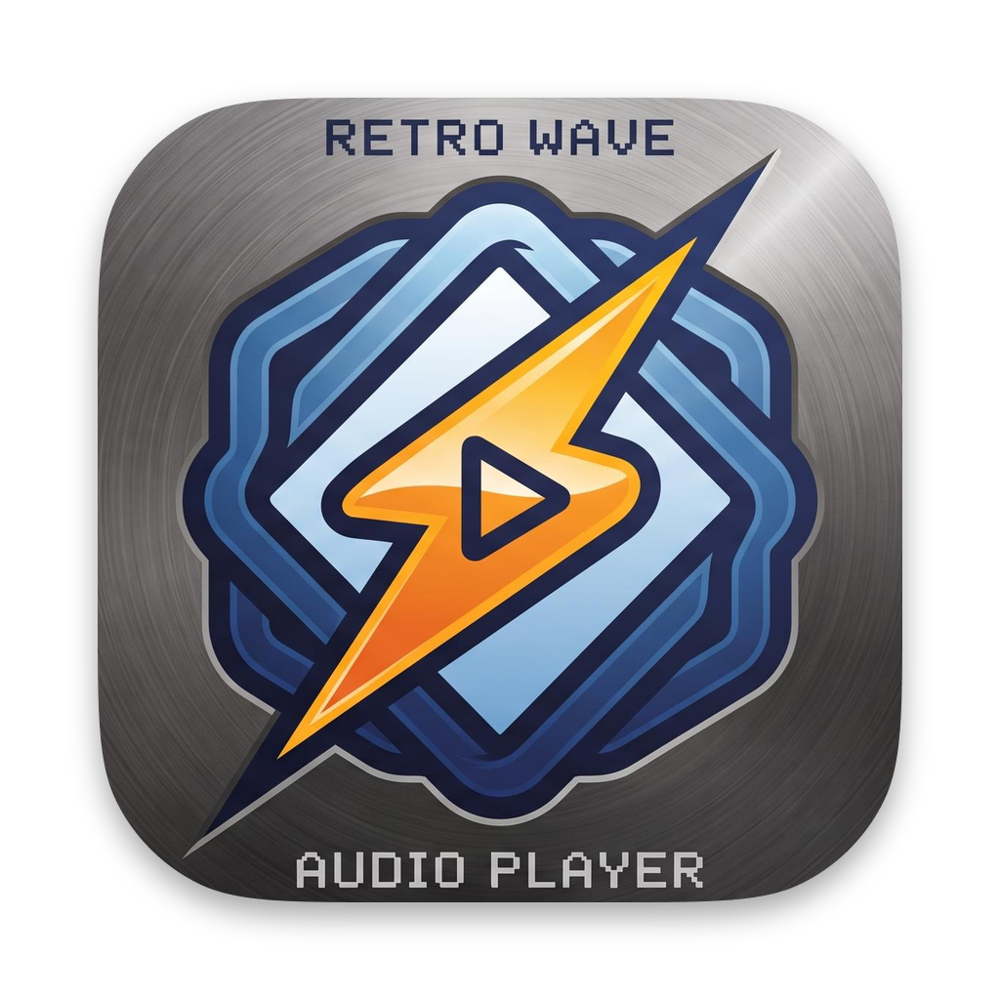
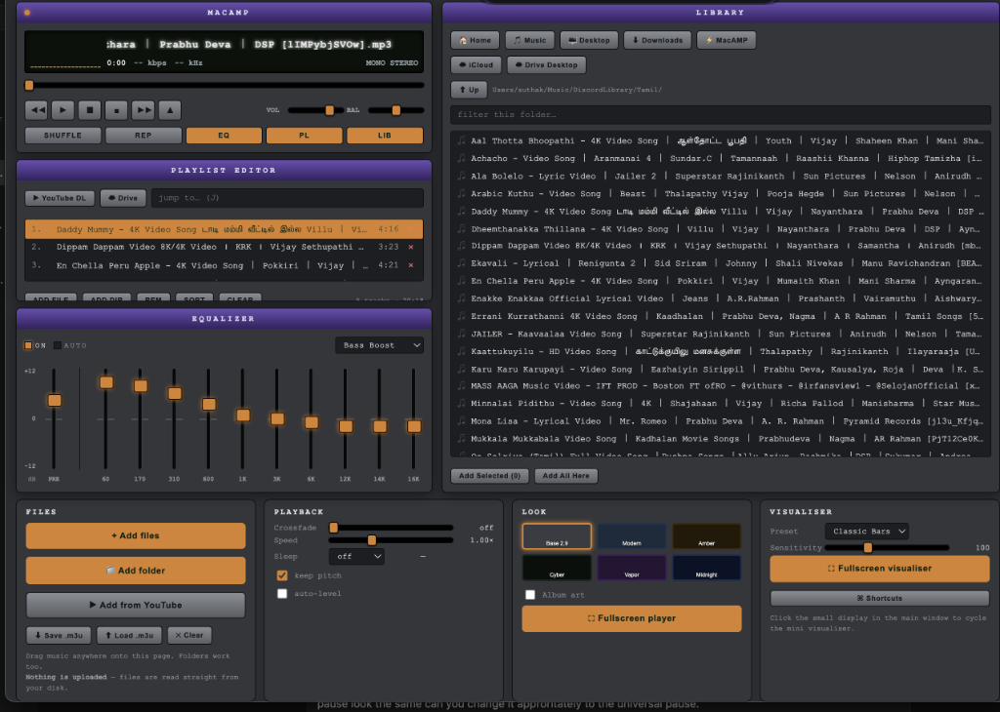

# <p align="center"><br>MacAMP</p>

<p align="center">
  <strong>A retro Winamp-style desktop music player modernized for macOS</strong><br>
  Built with Electron · Native macOS Titlebar · YouTube Downloader · 10-Band EQ · Cloud & Local Library
</p>

---

## Screenshots



---

## Features

- **Unified macOS Experience**: Native macOS traffic light controls (close, minimize, zoom) with a sleek integrated top drag bar.
- **YouTube Audio & Playlist Downloader**:
  - Paste any YouTube video or playlist link directly into the **Playlist Editor** (or via **▶ YouTube DL**).
  - High-quality audio extraction (`.mp3`) with full metadata, saved to `~/Music/MacAMP/`.
  - **Stream-as-You-Download**: In multi-song playlists, track 1 starts playing immediately while subsequent tracks continue downloading in the background.
- **10-Band Equalizer & Preamp**:
  - Real Web Audio BiquadFilter parametric EQ covering 60 Hz to 16 kHz plus preamp gain.
  - Bold, prominent slider travel aligned with `+12`, `0`, and `-12` dB indicators.
  - Center 0 dB notch marks.
  - Instant audio presets: *Bass Boost*, *Rock*, *Pop*, *Treble Boost*, *Dance*, *Classical*, and *Flat*.
- **Playlist Editor**:
  - Drag-and-drop audio files and directories.
  - Single-click selection and double-click to play.
  - Fast live search filter with Jump-to (`J`).
  - Sort, remove, clear, and save/load `.m3u` playlists.
- **Library Browser**:
  - Integrated full-featured file browser for local audio (`~/Music`, `~/Downloads`, `~/Desktop`, `~/Music/MacAMP`).
  - Automatic detection of synced cloud folders (iCloud Drive, Dropbox, OneDrive, Google Drive for Desktop).
  - Google Drive API integration for streaming files directly from Drive folders.
- **Retro Player & LCD Display**:
  - Real-time animated LCD track marquee and time display.
  - Mini spectrum visualizer (cycle Bars → Dots → Oscilloscope → Off).
  - Universal vector transport controls: Play, distinct Pause (`⏸`), Stop (`⏹`), Next, Prev, Eject.
- **Playback & Look Controls**:
  - True crossfading between tracks.
  - Speed (`playbackRate`) control with pitch-preservation toggle.
  - Dynamics-compressor auto-leveling.
  - Sleep timer.
  - 6 switchable retro-modern color themes: *Base 2.9*, *Modern*, *Amber*, *Cyber*, *Vapor*, and *Midnight*.
  - Fullscreen visualizer overlay with oscilloscope, spectrum bars, and sensitivity controls.

---

## Install on your Mac — no Terminal needed (recommended)

A GitHub Actions workflow builds the `.dmg` on a real macOS runner and attaches it to a GitHub Release.

1. Go to the **Actions** tab of this repo → **Build macOS App** (left sidebar).
2. Click **Run workflow** → **Run workflow** (leave branch as `main`).
3. Wait ~3–5 minutes for it to complete.
4. Under **Artifacts**, download **MacAMP-macOS** (a zip containing the `.dmg`).
5. Open the `.dmg` and drag **MacAMP** into **Applications**.
6. **First launch**: Right-click **MacAMP** in Applications → **Open** → **Open**.

---

## Install on your Mac (build from source)

1. Ensure [Node.js](https://nodejs.org) (v18+) is installed.
2. For YouTube downloading, `yt-dlp` and `ffmpeg` are recommended:
   ```sh
   brew install yt-dlp ffmpeg
   ```
3. Clone and install dependencies:
   ```sh
   git clone https://github.com/CodeBlueMD/MacAMP-retro-macos.git
   cd MacAMP-retro-macos
   npm install
   ```
4. Run locally in development mode:
   ```sh
   npm start
   ```
5. Package as a macOS app or DMG:
   ```sh
   npm run dist        # Builds release/MacAMP-1.1.0-universal.dmg
   npm run dist:dir    # Builds unpackaged .app in release/mac-arm64/
   ```

---

## Shortcuts

| Key | Action |
| --- | --- |
| <kbd>Space</kbd> | Play / Pause |
| <kbd>←</kbd> / <kbd>→</kbd> | Seek backward / forward 5s |
| <kbd>↑</kbd> / <kbd>↓</kbd> | Volume up / down |
| <kbd>Z</kbd> / <kbd>B</kbd> | Previous / Next track |
| <kbd>X</kbd> | Play |
| <kbd>C</kbd> | Pause |
| <kbd>V</kbd> | Stop |
| <kbd>L</kbd> | Open / Add files |
| <kbd>S</kbd> | Toggle Shuffle |
| <kbd>R</kbd> | Toggle Repeat |
| <kbd>J</kbd> | Focus Playlist "Jump to..." search |
| <kbd>Esc</kbd> | Exit fullscreen visualizer |

---

## License

MIT
